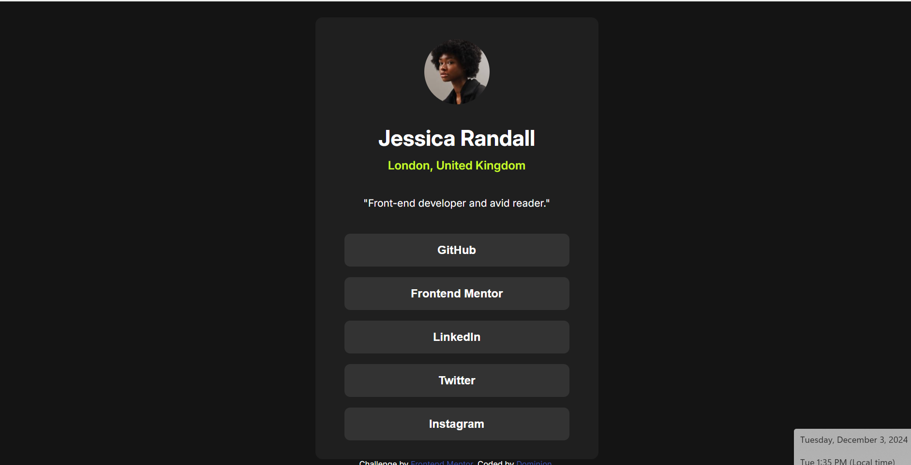

# Frontend Mentor - Social links profile solution

This is a solution to the [Social links profile challenge on Frontend Mentor](https://www.frontendmentor.io/challenges/social-links-profile-UG32l9m6dQ). Frontend Mentor challenges help you improve your coding skills by building realistic projects. 

## Table of contents

- [Overview](#overview)
  - [The challenge](#the-challenge)
  - [Screenshot](#screenshot)
  - [Links](#links)
- [My process](#my-process)
  - [Built with](#built-with)
  - [What I learned](#what-i-learned)
- [Author](#author)
- [Acknowledgments](#acknowledgments)

## Overview

### The challenge

Users should be able to:

- See hover and focus states for all interactive elements on the page

### Screenshot

### Links

- Solution URL: [https://github.com/why-not-phoenix/Mobile-first-social-links-profile](https://github.com/why-not-phoenix/Mobile-first-social-links-profile)
- Live Site URL: [https://why-not-phoenix.github.io/Mobile-first-social-links-profile/](https://why-not-phoenix.github.io/Mobile-first-social-links-profile/)

## My process

### Built with

- Semantic HTML5 markup
- CSS custom properties
- Flexbox
- Mobile-first workflow

### What I learned

Tried working with Mobile First workflow.
This is a pretty low level challenge so not much to recap

## Author

- Frontend Mentor - [@why-not-phoenix](https://www.frontendmentor.io/profile/why-not-phoenix)
- Twitter - [@dominion_onoja](https://x.com/dominion_onoja?t=RAWgmHy3YlUySDiPDnZS2g&s=09)

## Acknowledgments

Angela Yu.
